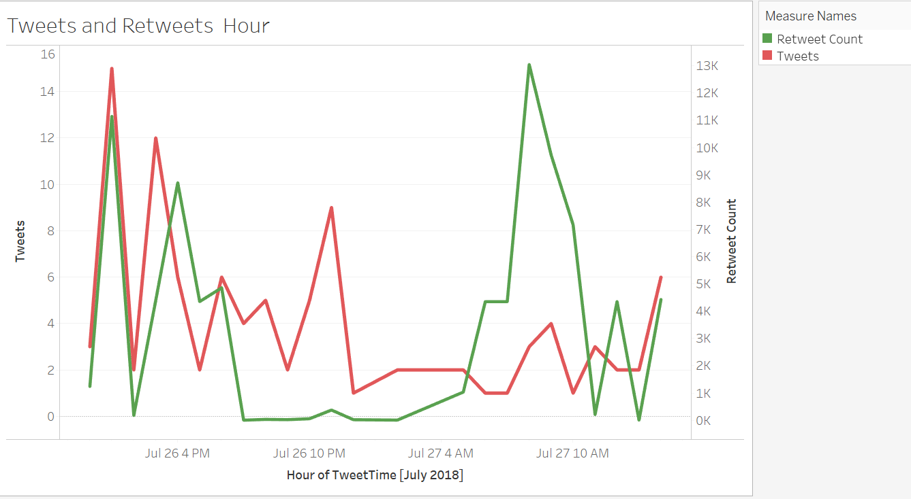
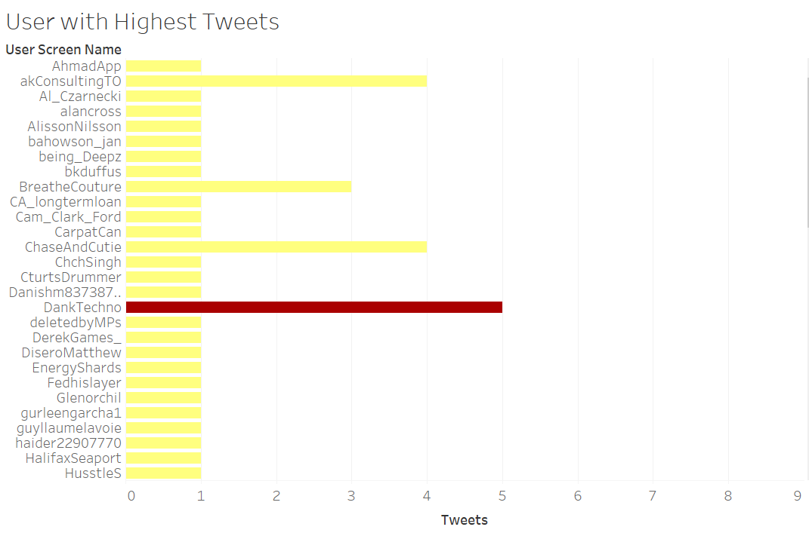
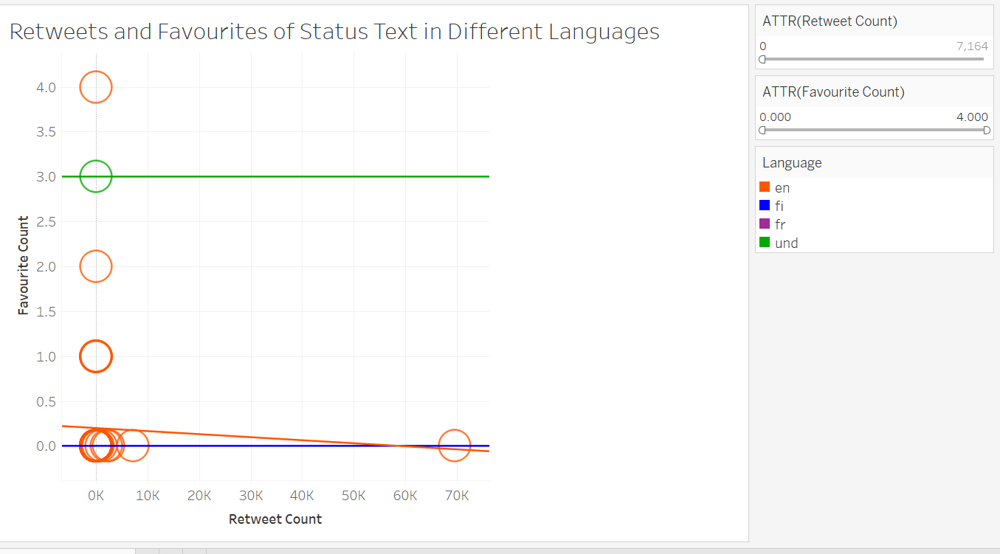

# TwitterAnalysisforHashtag-canadaday-using-Tableau

Using the twitter hashtag data and do the visualizations and provide description of the results. Hashtag Used: #canadaday

Scenario 1: The number of Tweets and Retweets for the hashtag on an hourly basis

Scenario 2: The user who has the maximum tweets for the hashtag #canadaday

Scenario 3:The retweets and favourites of the status text in different languages.

